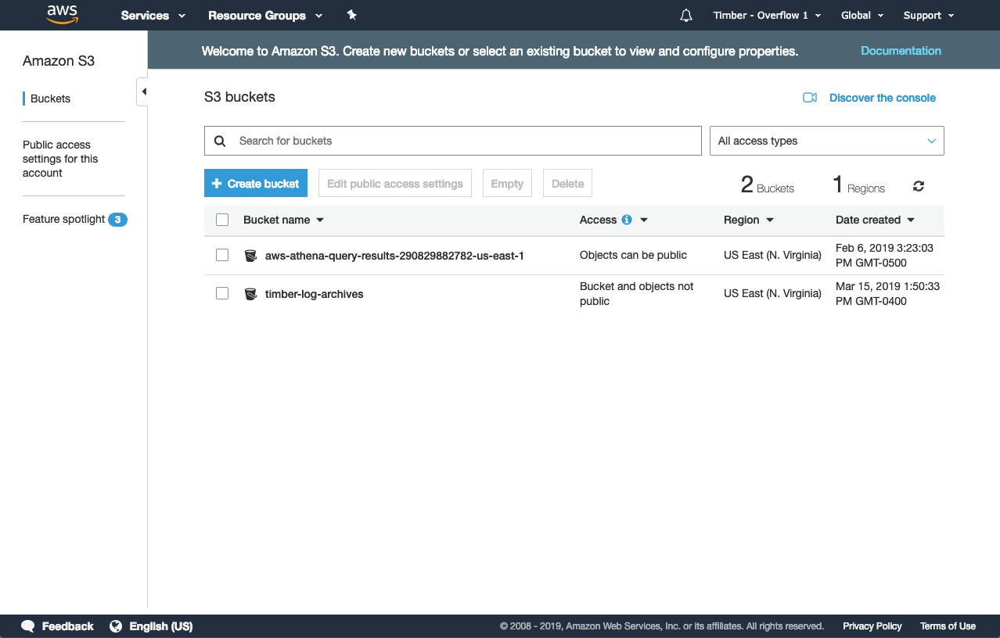
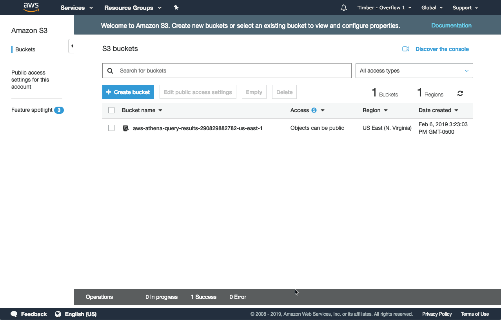

# Archiving

Timber offers the ability to store your log data in compressed archives on S3. This is a great way to retain your logs long term in a cost efficient manner.


You must have [`admin` privileges](account-management/role-based-access-control.md#permissions) to manage archiving.


## Getting Started

1. [Open the Timber web app.](https://app.timber.io)
2. Navigate to the Settings section using the [main navigation](../clients/web-app/#2-main-navigation).
3. Click the "Archives" tab.
4. Click the "Configure" button.
5. Select "Default Bucket". \(Instructions to use your own S3 bucket are [here](archiving.md#enabling)\).
6. Click "Save Archive Location"


## Usage

### Enabling


Use Timber's default S3 bucket for quick easy setup. Use your own S3 bucket for complete control over your archive's life cycle. More details [here](archiving.md#when-should-i-use-my-own-s3-bucket).




1. [Open the Timber web app.](https://app.timber.io)
2. Navigate to the Settings section using the [main navigation](../clients/web-app/#2-main-navigation).
3. Click the "Archives" tab.
4. Click the "Configure" button.
5. Select the "Default" bucket type.
6. Click "Save Archive Location"



1. [Create your S3 bucket](https://docs.aws.amazon.com/AmazonS3/latest/gsg/CreatingABucket.html) .
2. Add a the [Timber bucket policy](archiving.md#permissions).
3. [Open the Timber web app.](https://app.timber.io)
4. Navigate to the Settings section using the [main navigation](../clients/web-app/#2-main-navigation).
5. Click the "Archives" tab.
6. Click the "Configure" button.
7. Select the "Custom" bucket type.
8. Enter your S3 bucket location: `s3://my-bucket-name`
9. Click "Save Archive Location"
10. Timber will validate your location before saving. If your setting successfully save then your bucket is working and active.



### Downloading



1. [Open the Timber web app.](https://app.timber.io)
2. Navigate to the Settings section using the [main navigation](../clients/web-app/#2-main-navigation).
3. Click the "Archives" tab.
4. You'll see a list of archives grouped by date.
5. Click on the appropriate date.
6. Click "Download Link" for the app you want to download.




Because you've elected to use your own S3 bucket you'll need to use the S3 console to browse and download your archives. For security and compliance reasons, Timber only has write access to your bucket, not read access.


1. Open the [S3 console](https://s3.console.aws.amazon.com/s3/home?region=us-east-1).
2. Navigate to the bucket you configured Timber to use.
3. Click on the appropriate date.
4. Download the archive for your chosen source.



### Expiring



Timber automatically expires your archives after 1 year. Currently this is not configurable. If you wish to change this we recommend using your S3 own bucket, giving you complete control over your archive lifecycle management.



Because you've elected to use your own S3 bucket, archive expiration is entirely under your control through [S3's lifecycle policies](https://docs.aws.amazon.com/AmazonS3/latest/dev/object-lifecycle-mgmt.html). Timber only has write access to your bucket, it does not have read or delete access. 

1. Open the S3 console.
2. Click on your S3 bucket.
3. A side panel will slide out.
4. Click on the "Management" section.
5. Click "Add lifecycle rule".
6. Follow the lifecycle rule wizard. Amazon's wizard should make it easy to select the option to suit your expiration preferences.





### Disabling


Disabling archives does not delete your archives, it simply stops creating them.


You can disable archiving at any time.

1. [Open the Timber web app.](https://app.timber.io)
2. Navigate to the Settings section using the [main navigation](../clients/web-app/#2-main-navigation).
3. Click the "Archives" tab.
4. Click the "Configure" button.
5. Select "Disabled" for Bucket Type.
6. Click "Save Archive Location"

### Deleting



Timber does not offer the ability to delete individual archives. You must [delete your entire source](source-management.md#deleting) to delete the archives. If you want granular control over your archives we recommend [using your own S3 bucket](archiving.md#enabling).



Because you've elected to use your own S3 bucket you have full control over deleting your archives.

1. Open the [S3 console](https://s3.console.aws.amazon.com/s3/home?region=us-east-1).
2. Navigate to the bucket you configured Timber to use.
3. Delete archives as necessary.



## Configuration

### Your Own S3 Bucket


Only S3 buckets in the `us-east-1` region are supported.


#### Permissions

In order for Timber to write archives to your S3 bucket you must grant Timber permission through a [bucket policy](https://docs.aws.amazon.com/AmazonS3/latest/dev/using-iam-policies.html). _**Replace `my-logs` with your bucket name!**_

```javascript
{
  "Version":"2012-10-17",
  "Statement":[
    {
      "Sid":"AddLogs",
      "Effect":"Allow",
      "Principal": {"AWS": ["arn:aws:iam::754402436383:root"]},
      "Action":["s3:PutObject"],
      "Resource":["arn:aws:s3:::my-logs/*"]
    }
  ]
}
```



#### Recommended Settings

We recommend configuring your S3 bucket with the following settings:

1. [Enable versioning](https://docs.aws.amazon.com/AmazonS3/latest/dev/Versioning.html) - Recovery for accidental deletes.
2. [Enable encryption](https://docs.aws.amazon.com/AmazonS3/latest/dev/UsingEncryption.html) - Extra security.
3. [Add a lifecycle rule to automatically move the files to IFA](https://docs.aws.amazon.com/AmazonS3/latest/dev/object-lifecycle-mgmt.html) - Infrequent access is recommended over glacier since it is quicker to access and search when you need it.
4. [Add a lifecycle rule to expire archives after 1 year, adjust as necessary](https://docs.aws.amazon.com/AmazonS3/latest/dev/object-lifecycle-mgmt.html) - 1 year should be sufficient for most compliance policies.

## How It Works

### Interval

Timber's archives are daily. Once a day Timber will roll up all of your log data into an archive and place it in your configured destination. This usually happens around 3am EST but could vary depending on other factors.

### Archive Format

Archive files are stored in `.tar.gz` \([tar](https://en.wikipedia.org/wiki/Tar_%28computing%29) [gzipped](https://en.wikipedia.org/wiki/Gzip)\) format.

### Archive Contents

Archive contents are _full_ dumps of your log data in in [`ndjson` format](http://ndjson.org/). Each log line includes every single field in JSON format. To learn more about fields see the [Dynamic Schema Managemen](../under-the-hood/schema-maintenance.md)t and [Reserved Fields sections](../under-the-hood/log-processing.md#reserved-fields).

```javascript
{"dt":"2019-03-12T02:22:12.445Z","level":"info","message":"Log line 1","context":{"system":{"host":"my.host.com"}}}
{"dt":"2019-03-12T02:22:13.426Z","level":"info","message":"Log line 2","context":{"system":{"host":"my.host.com"}}}
{"dt":"2019-03-12T02:22:14.248Z","level":"info","message":"Log line 3","context":{"system":{"host":"my.host.com"}}}
{"dt":"2019-03-12T02:22:15.544Z","level":"info","message":"Log line 4","context":{"system":{"host":"my.host.com"}}}
{"dt":"2019-03-12T02:22:16.521Z","level":"info","message":"Log line 5","context":{"system":{"host":"my.host.com"}}}
```

### Compression

Final archive files are [gzipped](https://en.wikipedia.org/wiki/Gzip).

## FAQs

### When should I use my own S3 bucket?

For convenience and ease of use Timber offers a "default" S3 bucket that we own and maintain. Archives are [downloaded](archiving.md#downloading-archives) directly from the Timber interface. If have specific security or compliance needs then we recommend [using your own S3 buckets](archiving.md#enabling). This puts you in complete control over durability, security, and compliance settings.

### How long are my archives retained?

If you're using Timber's S3 bucket your archives are retained for 1 year. If you're using your own bucket you are entirely in control of when you archives expire. See the [configuration section on configuring your own S3 bucket](archiving.md#own-s3-bucket) for more details.

