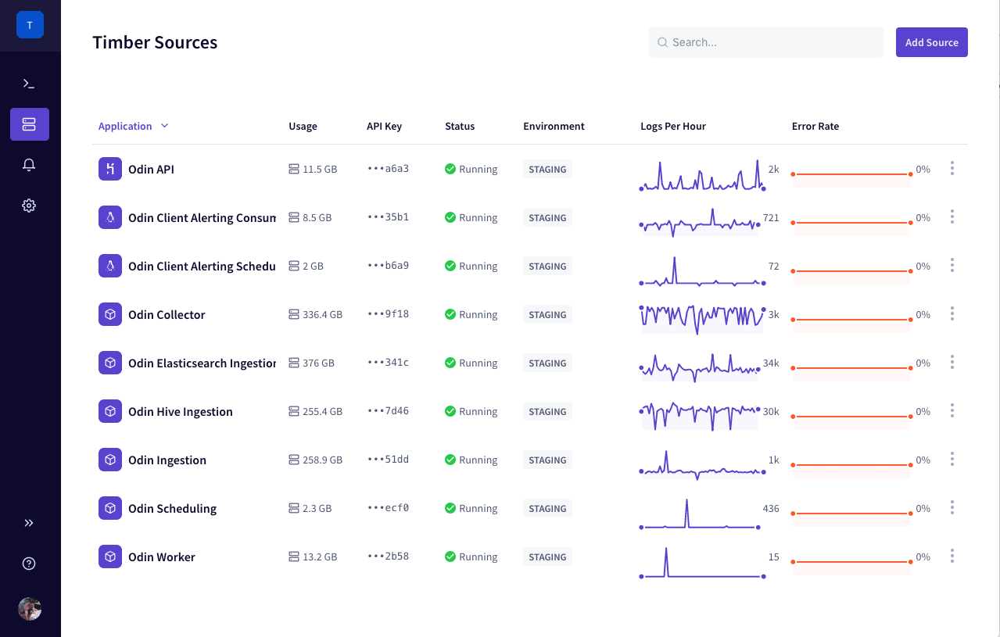
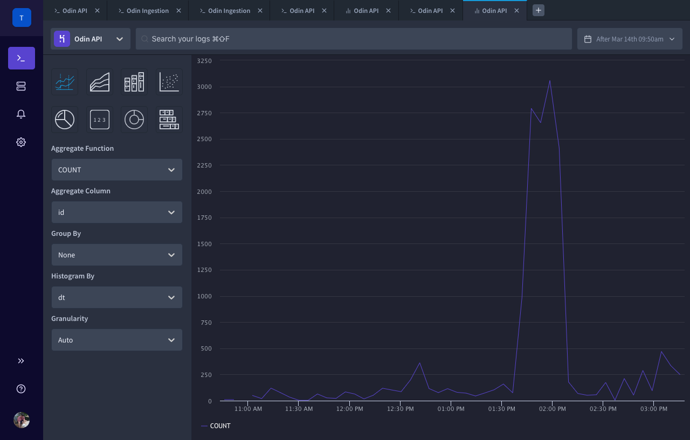
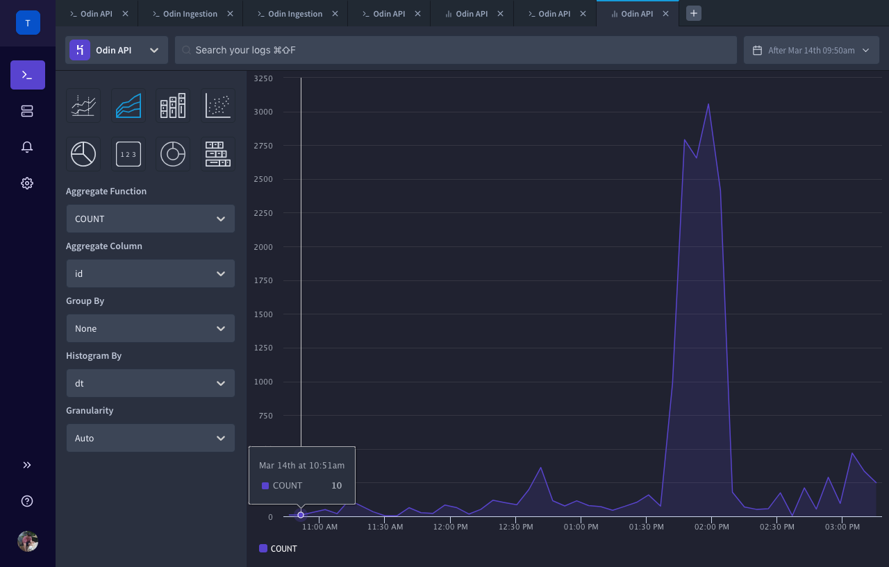
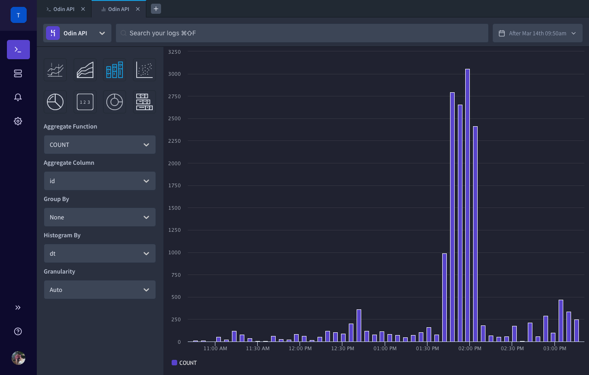
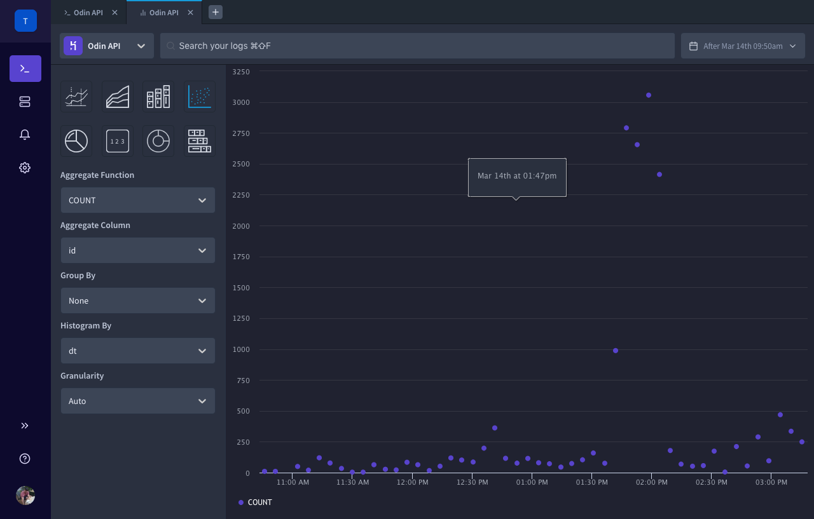
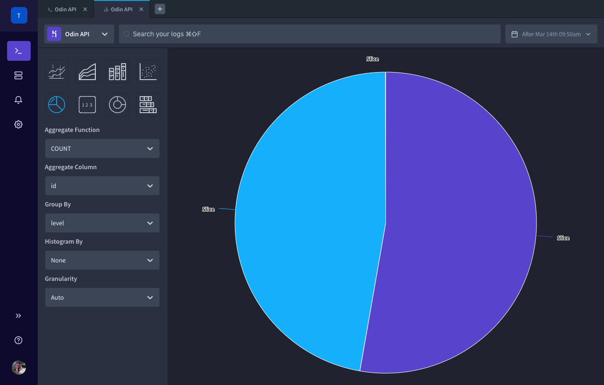
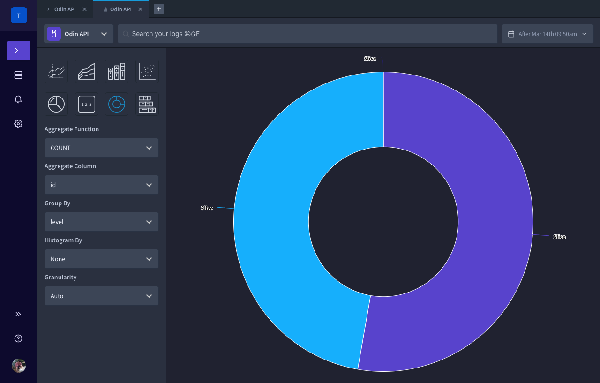

# Graphing

Timber offers the ability to graph and visualize your log data.

## Getting Started

1. [Open the Timber web app](https://app.timber.io).
2. Navigate to the [Console](../clients/web-app/#the-console) using the [main navigation](../clients/web-app/#2-main-navigation).
3. Select the desired source that you want to graph.
4. A new [live tail tab](live-tailing.md) will open.
5. [Filter your results](live-tailing.md#query-syntax) as necessary.
6. Click on the graph icon in the top right of the console. This will open a new graph tab. 



## Usage

### Fields

#### Chart Type



The line graph should be used in conjunction with the [histogram by option](graphing.md#histogram-by), allowing you to view data points over time.





The area graph should be used in conjunction with the [histogram by option](graphing.md#histogram-by), allowing you to view data points over time.





The column type operates on the _x-axis_ and is great for viewing grouped data. As such, we recommend using it with the [group by option](graphing.md#group-by).





The bar type operates on the _y-axis_ and is great for viewing grouped data. As such, we recommend using it with the [group by option](graphing.md#group-by).





The scatter type is great for viewing data over time. As such, we recommend using it with the [histogram by option](graphing.md#histogram-by).





The pie type operates is great for viewing percentages. As such, it should be used with the [group by option](graphing.md#group-by).





The pie type operates is great for viewing percentages. As such, it should be used with the [group by option](graphing.md#group-by).





The counter type is used to display a single number.



The chart type represents how you want to visualize your data.

#### Aggregate Function

The function used to compute the numerical aggregates across the specified interval, `MAX` in the following query:

```sql
SELECT MAX(`http_response_sent.duration_ms`) FROM table
```

#### Aggregate Column

The target column used as the argument to the aggregate function, `id` in the following query:

```sql
SELECT COUNT(id) FROM table
```

#### Group By

The column to group and break out results by, `level` in the following query:

```sql
SELECT COUNT(*) FROM table GROUP BY level
```

#### Histogram By

The column histogram over, creating intervals of time, `dt` in the following query:

```sql
SELECT COUNT(*) FROM table GROUP BY floor(dt - mod(dt, 60))
```

#### Granularity

Controls how granular each histogram interval is.

### Zooming In/Out

Simply click and drag on the graph to zoom in.


