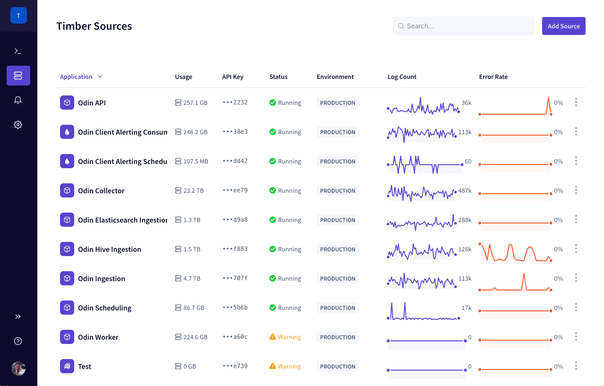

# Live Tailing

Timber's live-tail feature lets you access and search your logs in real-time. Log will automatically appear within seconds of being sent to Timber.


This feature is designed for simple, fast, real-time access to your logs. For complex querying please see our [SQL Querying feature](sql-querying.md).


## Getting Started



1. [Open the Timber web app](https://app.timber.io).
2. Navigate to the Console using the [main navigation](../clients/web-app/#main-navigation).
3. Select the desired source that you want to tail.
4. A new tab will open and live tailing will begin automatically.
5. Optionally enter a [search](live-tailing.md#query-syntax) to filter your results.





1. Download and install the `timber` CLI
2. Execute the `timber tail --source-id 1234`  command.
3. Optionally specify a `--query "my query"` flag to filter your results.



## Query Syntax

Timber's live-tail query syntax follows a limited [Lucene style syntax](https://lucene.apache.org/core/2_9_4/queryparsersyntax.html). For more complex queries please see the [SQL Querying guide](sql-querying.md).

### Definition

```text
[ [ negation ], condition ] [ delimiter ] [ ... ]
```

Where:

```ruby
negation = "!" | "-" ;
condition = { all characters - " " } | '"', { all characters }, '"' ;
delimiter = " " | "AND" | "OR" ;
all characters = ? all visible characters ? ;
```

### Reserved Characters

Timber reserves the following characters to implement the our query syntax:

| Category | Character\(s\) | Description |
| :--- | :--- | :--- |
| Wildcards | `*` | Wildcard matching 0 or more characters |
|  | `?` | Wildcard matching _exactly_ 1 character |
| Equality | `:` | The field on the left equals the value on the right |
|  | `:-` | The field on the left does not equal the value on the right |
|  | `:>` | The field on the left is greater than the value on the right |
|  | `:>=` | The field on the left is greater than or equal to the value on the right |
|  | `:<` | The field on the left is less than the value on the right |
|  | `:<=` | The field on the left is less than or equal to the value on the right |
| Negation | `-` | Negates the result of the following `condition` |
|  | `!` | Negates the result of the following `condition` |
| Delimiters |  `` | Space. This is an implied delimiter equivalent to using `AND` |
|  | `AND` | The `condition`s on the left and right must be true |
|  | `OR` | The `condition`s on the left or right must be true  |
| Grouping | `(`, `)` | Evaluates the following sequence of characters into a single result, must be terminated with a final `)` |
| Escaping | `\` | Escapes the following character, treating it as literal |
|  | `"`, `"` | Treats the following sequence of characters as literal, must be terminated with a final `"` |

### Examples

#### Text Search Examples

| Example | Description |
| :--- | :--- |
| `paul bunyan` | Contain `paul` _and_ `bunyan` |
| `"paul bunyan"` | Literal search, contains the `paul bunyan` phrase exactly |
| `pau*` | Contains any word starting with `pau` followed by any number of characters |
| `pau?` | Contains any word starting with `pau` followed by 1 character |
| `pau??` | Contains any word starting with `pau` followed by 2 characters |

#### Attribute Search Example

Attributes are any field you send with your log data. Nested fields accessed with a `.` delimited path:

| Example | Description |
| :--- | :--- |
| `user.name:"paul bunyan"` | The `user.name` field is equal to `paul bunyan` |
| `http_response_sent.status:>=500` | The `http_response_sent.status` field is greater than `500` |
| `http_respopnse_sent.status:-500` | The `http_response_sent.status` field does not equal `500` |

#### Operator Examples

| Example | Description |
| :--- | :--- |
| `-paul` | Does not contain `paul` |
| `!paul` | Does not contain `paul` |
| `paul AND bunyan` | Both conditions, on each side of `AND`, must evaluate to true |
| `NOT paul` | Does not contain `paul` |
| `paul OR bunyan` | One condition, on either side of `OR`, must evaluate to true |
| `(paul OR bunyan) AND ox` | Contains `paul` or `bunyan,` and `ox` |
| `-(paul OR bunyan) AND ox` | Does not contain `paul` or `bunyan,` and contains `ox` |

## Date Ranges

## Jumping To A Date

## Faceting

## Viewing Context

## Changing The Line Format

## 


