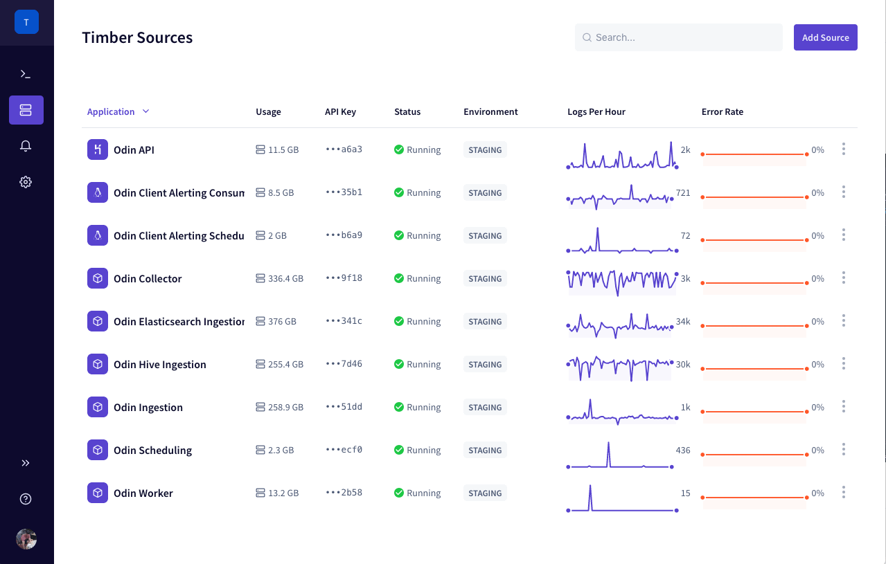

# Saved Views

The Timber console implements a tab based interface, allowing you save tabs as "views".

## Getting Started

### Saving A View



1. [Open the Timber web app](https://app.timber.io).
2. Navigate to the [Console](../clients/web-app/#the-console) using the [main navigation](../clients/web-app/#2-main-navigation).
3. Open a new tab and customize it as you please.
4. In the bottom right of the interface click "Save View"






Saving views within the Timber CLI is currently not supported, but we do support loading \(see below\).




### Loading A View



1. [Open the Timber web app](https://app.timber.io).
2. Navigate to the [Console](../clients/web-app/#the-console) using the [main navigation](../clients/web-app/#2-main-navigation).
3. Open a new tab.
4. In the second column you'll see a list of saved views.
5. Select the view to load it.





1. [Install the `timber` CLI.](../clients/cli/#installation)
2. List your available views:  


   ```bash
   timber views
   ```

3. Execute the `tail` command by providing your chosen view ID:  


   ```bash
   timber tail --view-id [view_id]
   ```



## How It Works

When you save a view you're saving all of the parameters of your view:

* The sources being searched
* [The current query](live-tailing.md#query-syntax)
* The date range / live-tail status
* [The log line format](live-tailing.md#changing-the-log-line-format)

