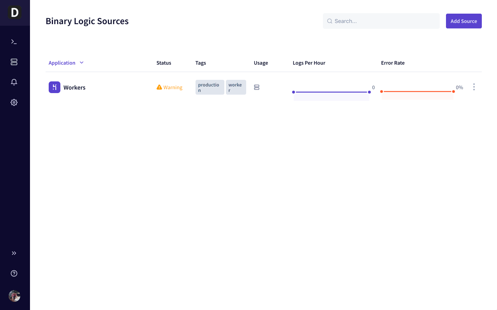

# Source Management

Timber's source management section lets you manage all aspects of your log sources.

A "source" is simply a source of log data. For example, a Ruby app, Kubernetes cluster, Linux server, log file, or a AWS Lambda function are all examples of sources within Timber. It is purposefully generic and anything that contains log data is a valid source.

## Getting Started

1. [Open the Timber web app](https://app.timber.io).
2. Navigate to the Sources section using the [main navigation](../clients/web-app/#2-main-navigation).
3. Click the "Add Source" button.
4. Select your [language](../setup/languages/), [platform](../setup/platforms/), [log forwarder](../setup/log-forwarders/), or [operating system](../setup/operating-systems/). Whichever method you prefer to send your log data to Timber.
5. Click the link to open the appropriate integration instructions.
6. Follow the instructions to integrate Timber.
7. Verify log delivery.

## Usage

### Creating

See the [Getting Started section](source-management.md#getting-started).

### Updating

1. [Open the Timber web app](https://app.timber.io).
2. Navigate to the Sources section using the [main navigation](../clients/web-app/#2-main-navigation).
3. Hover over the source you want to edit and click the context menu icon on the far right.
4. Click "Settings"
5. Edit your source as desired.
6. Click "Update".

### Viewing Installation Instructions

1. [Open the Timber web app](https://app.timber.io).
2. Navigate to the Sources section using the [main navigation](../clients/web-app/#2-main-navigation).
3. Hover over the source you want to edit and click the context menu icon on the far right.
4. Click "Installation"

### Debugging

1. [Open the Timber web app](https://app.timber.io).
2. Navigate to the Sources section using the [main navigation](../clients/web-app/#2-main-navigation).
3. Hover over the source you want to edit and click the context menu icon on the far right.
4. Click "Installation"
5. Click on the "Debugger" tab.
6. Notice the `curl` command at the bottom. You can use this to test the pipe and verify log delivery is possible.
7. Head over to the [Troubleshooting Log Delivery guide](../guides/troubleshooting-log-delivery.md) for a deeper debugging guide.

### Deleting


When you delete a source all associated log data is _permanently_ deleted, including [archives](archiving.md)! This is a non-reversible process. Please make sure you have the data you need before proceeding.


1. [Open the Timber web app](https://app.timber.io).
2. Navigate to the Sources section using the [main navigation](../clients/web-app/#2-main-navigation).
3. Hover over the source you want to edit and click the context menu icon on the far right.
4. Click "Delete"
5. Click "Delete source" in the "Danger Zone"

